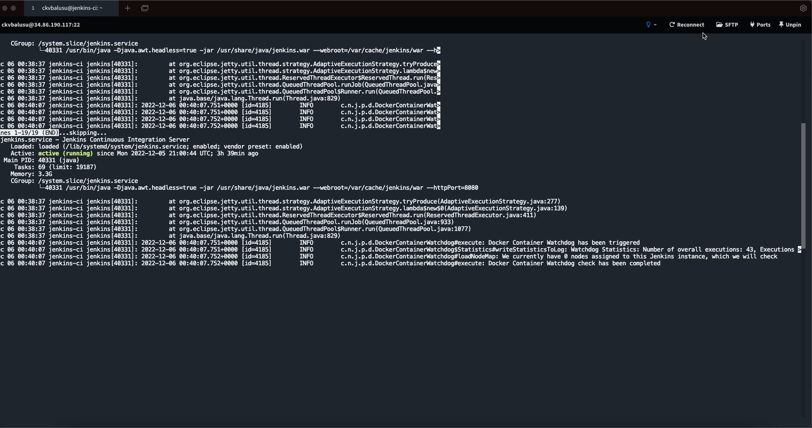
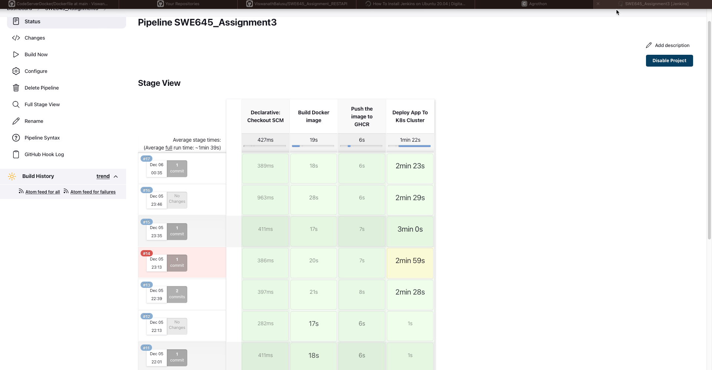
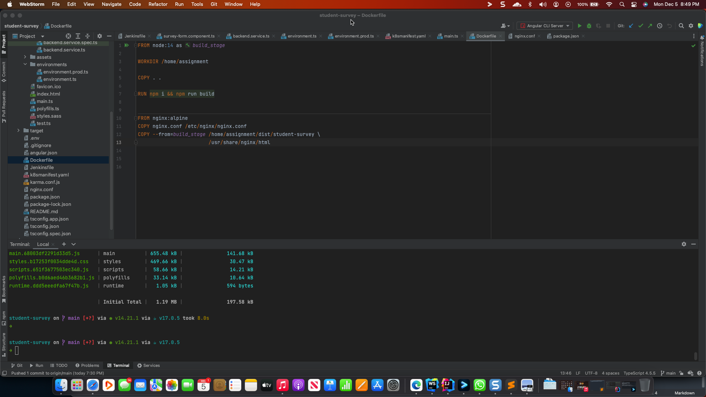
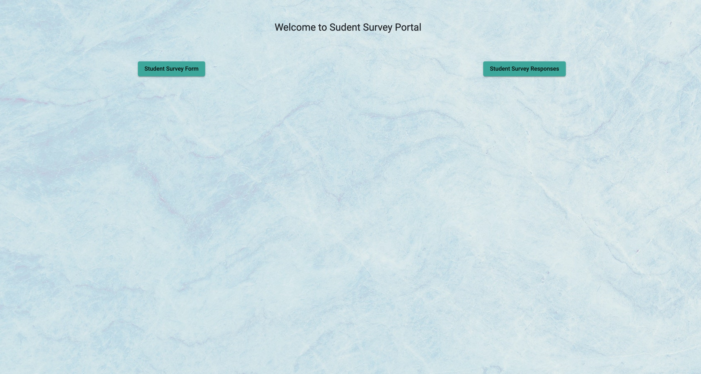
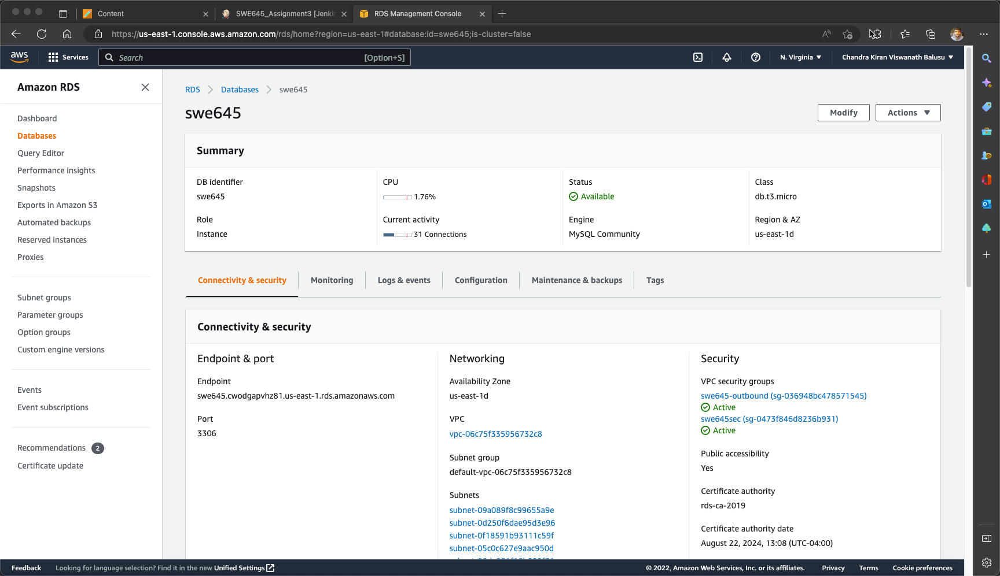
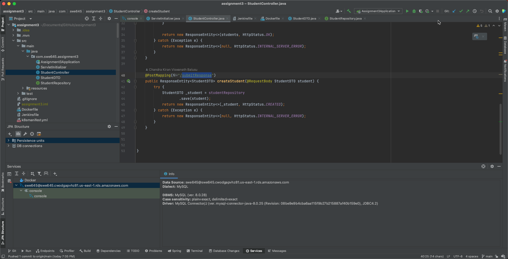
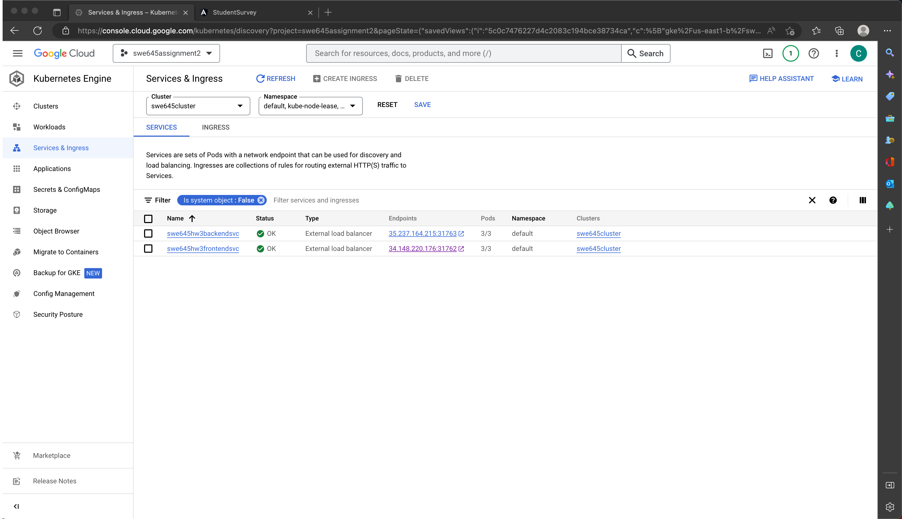
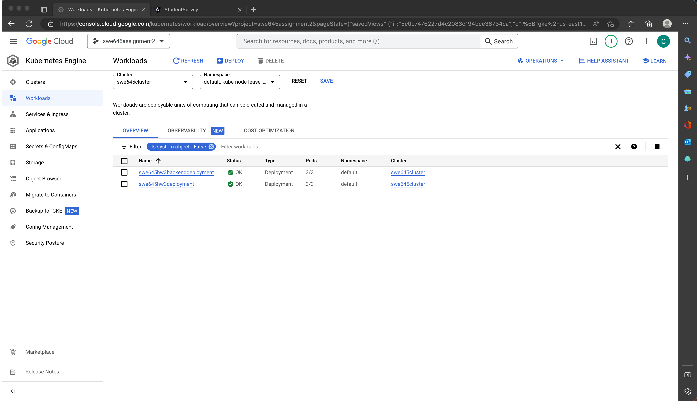

# SWE645 - Assignment 3


## Teammates

- Chandra Kiran Viswanath Balusu - G01351345
- Hemanth Kumar Reddy Tiyyagura - G01350509
- Anusha Bhavanam - G01348764
- Bharath Chandra Nimmala - G01346154
- Siva Satyanarayana Raju Pusapati - G01355494


## Contributions

- Chandra Kiran Viswanath Balusu - `Developed jenkins pipelines for both frontend and backend, and managed everything required by Jenkins such as Git, kubectl`
- Hemanth Kumar Reddy Tiyyagura - `Developed the frontend Angular components and provisioned the k8s cluster`
- Anusha Bhavanam - `Developed angular services and provisioned a VM for the jenkins deployment`
- Siva Satyanarayana Raju Pusapati - `Wrote the K8s manifest files for the kubernetes frontend and backend deployments` 
- Bharath Chandra Nimmala - `Provisioned MySQL database in AWS Cloud using RDS service and developed the backend required for the application`

## Prerequisites and Tools

### Installing Node.js on Ubuntu:

```
	curl -sL https://deb.nodesource.com/setup_14.x | bash && \
    #Node JS and NPM
    apt-get install -y nodejs && \
    curl -sS https://dl.yarnpkg.com/debian/pubkey.gpg | apt-key add - && \
    echo "deb https://dl.yarnpkg.com/debian/ stable main" | tee /etc/apt/sources.list.d/yarn.list && \
    apt-get update && \
    #Yarn
    apt-get install -y yarn
```

### Installing Angular:

```
	   Installing it globally:
		npm install -g @angular/cli
```

### Installing JAVA
    ```
    wget https://adoptopenjdk.jfrog.io/adoptopenjdk/api/gpg/key/public && \
        gpg --no-default-keyring --keyring ./adoptopenjdk-keyring.gpg --import public && \
        gpg --no-default-keyring --keyring ./adoptopenjdk-keyring.gpg --export --output adoptopenjdk-archive-keyring.gpg && \
        rm adoptopenjdk-keyring.gpg && \
        mv adoptopenjdk-archive-keyring.gpg /usr/share/keyrings  && \
        echo "deb [signed-by=/usr/share/keyrings/adoptopenjdk-archive-keyring.gpg] https://adoptopenjdk.jfrog.io/adoptopenjdk/deb focal main" | sudo tee /etc/apt/sources.list.d/adoptopenjdk.list && \
        apt-get update && \
        apt-get install -y adoptopenjdk-17-hotspot
    ```


### Installing Jenkins

```
    wget -q -O - https://pkg.jenkins.io/debian-stable/jenkins.io.key | sudo apt-key add -
    sudo sh -c 'echo deb http://pkg.jenkins.io/debian-stable binary/ > /etc/apt/sources.list.d/jenkins.list'
    sudo apt update
    sudo apt install jenkins
```




### Installing Caddy

- We used caddy to expose jenkins to the public domain `https://jenkins.chandu.ml `

-  ```
    sudo apt install -y debian-keyring debian-archive-keyring apt-transport-https
    curl -1sLf 'https://dl.cloudsmith.io/public/caddy/stable/gpg.key' | sudo gpg --dearmor -o /usr/share/keyrings/caddy-stable-archive-keyring.gpg
    curl -1sLf 'https://dl.cloudsmith.io/public/caddy/stable/debian.deb.txt' | sudo tee /etc/apt/sources.list.d/caddy-stable.list
    sudo apt update
    sudo apt install caddy
   ```

### Installing Docker

```
    curl -sSL https://get.docker.com | sudo sh
    sudo usermod -aG docker ${USER}
```

# Developement and Deployment:

## Developing the Frontend Interface using Angular:
 
- Generated an angular template using angular CLI
- Used angular material module.
- Created two components in our new project, for the survey form and previous responses
- To create the component, used the command `ng g c <component-name> `
- created a service to communicate with backend `ng g s <service-name>`
- wrote a Dockerfile which is a multi stage build
- Which in its first stage builds the artifacts/dist files
- and we used Nginx to Serve the Angular Dist files
- Frontend Repository
    - 
- 
- 
- 


## Provisioning a MySQL Database in AWS RDS

- Created a Database using the guide provided in Blackboard
- Added Security groups that grant access everywhere so that GCP can access the DB using deployments
- 

## Developing the Backend using Spring Boot:

- Create a template for the SpringBoot Project using IntelliJ IDEA
- Filled the MYSQL URL in application.properties Which we created in AWS RDS.
- Created a Student DTO Class which is a model class for the table in the MySQL
- Created controller class which handles the API Routes
- In the `pom.xml` we actually using `war` type artifact
- We created the WAR file using maven with the command, `mvn compile war:war`
- Which in its first stage builds the artifacts/dist files
- We used tomcat as before for serving the WAR file
- Routes are `/api/responses` for getting all the responses and `/api/submitResponse` for submitting a Response
- Backend Repository
  - 
- GCP Load Balancer Services
  - 
- GCP Deployments
  - 

## Github Repository
- [Frontend](https://github.com/ViswanathBalusu/SWE645_Frontend_Angular) - Private Repository
- [Backend](https://github.com/ViswanathBalusu/SWE645_Assignment_RESTAPI) - Private Repository

## Video Demonstration
- [Youtube](https://youtu.be/edvH8vE0H4Y)

## AWS EC2 of Part 1
- [AWS S3 URL](http://ckvbalusu-swe645-ass1-part1.s3-website-us-east-1.amazonaws.com/)

## K8s Load Balancer URL
- [Frontend](http://34.148.220.176:31762/)
- [Backend](http://35.237.164.215:31763/assignment3/)
